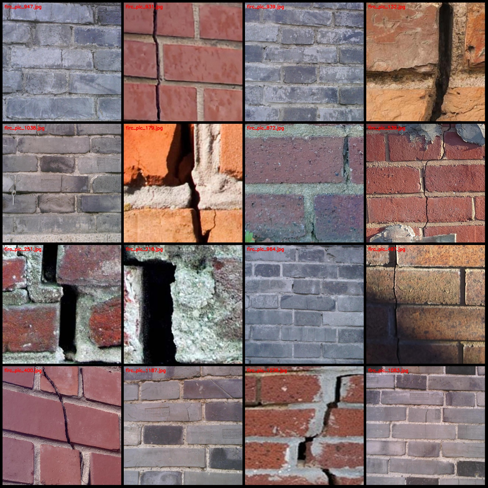
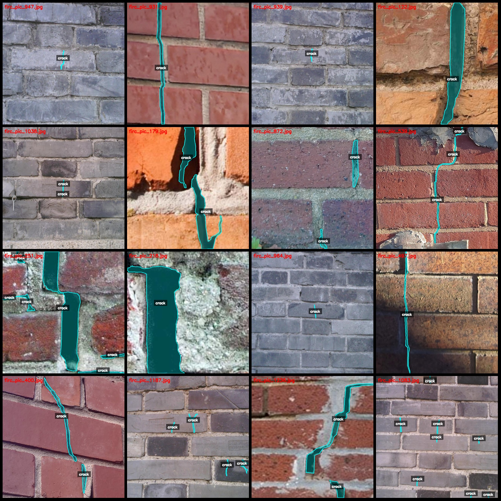
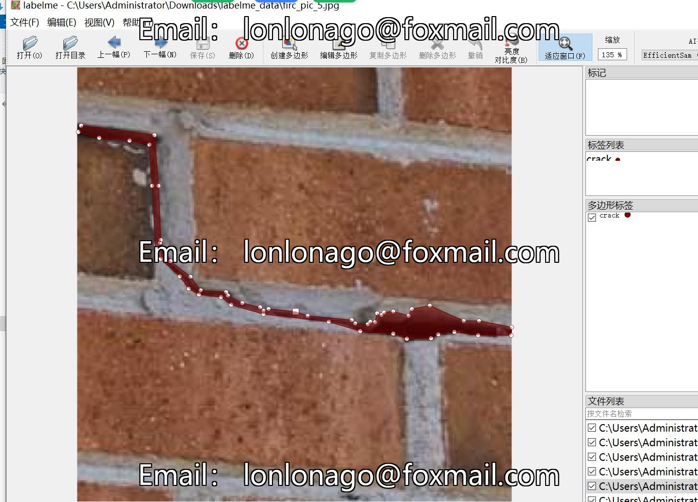

# Wall Tiles Crack Identification and Segmentation Dataset - LabelMe Format: 1273 categories

The dataset is formatted as a labelme file (excluding the mask files, containing only JPG images and their corresponding JSON files). 

- Number of images (JPG file count): 1273
- Number of annotations (JSON file count): 1273
- Number of annotation categories: 1
- Annotation category name: ["crack"]
- Number of bounding box counts for each category: 2974
- Total number of bounding boxes: 2974
- Annotation tool used: labelme v5.5.0
- Image resolution: 640x640
- Annotation rules: Polygons are drawn around the classes.
- Important note: The dataset can be opened and edited using labelme. The JSON dataset requires conversion to either mask or yolo/coco format for semantic segmentation or instance segmentation.
- Special declaration: This dataset does not guarantee the accuracy of the trained models or weight files.

Preview of some randomly selected images:

Example of annotation drawing:

Labelme editing example:
## Images

Here is a pay link on Stripe ( https://buy.stripe.com/3cs8yP7sY87d0vu9AB ). Please contact me lonlonago@foxmail.com after funding $89, and I will send you a complete data files , thank you!

